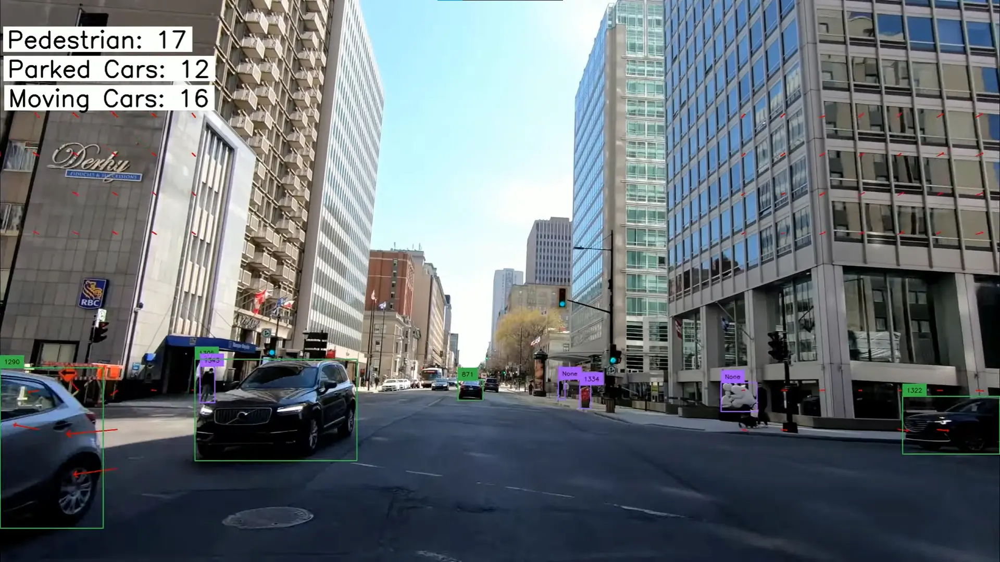

<!-- PROJECT LOGO -->
 

  
  <h3 align="center"><a href="https://www.youtube.com/watch?v=HI_XG6K85M4"> Parked Car, Moving Car and Pedestrian Detection </a></h3>
  

  

    Detect the number of parked cars, moving cars and pedestrians passed using multiple computer vision techniques and libraries, such as optical flow, YoloV8, ByteTrack, etc.     
  

<!-- TABLE OF CONTENTS -->

  
Table of Contents

  <ol>
    <li>
      <a href="#about-the-project">About The Project</a>
      <ul>
        <li><a href="#built-with">Built With</a></li>
      </ul>
    </li>
    <li>
      <a href="#getting-started">Getting Started</a>
    </li>
  </ol>

<!-- ABOUT THE PROJECT -->
## About The Project

Parked Car, Moving Car and Pedestrian Detection

Application made with Python, YoloV8, ByteTrack and OpenCV

Features:
* Distinguis moving cars from parked cars
* Detect pedestrians
* Count and show the number of objects
### Built With

* 
<!-- GETTING STARTED -->

(<a href="#readme-top">back to top</a>)

[React.js]: https://img.shields.io/badge/React-20232A?style=for-the-badge&logo=react&logoColor=61DAFB
[React-url]: https://reactjs.org/
